# Project Name

KABAN


> A Kanban board application with microservices architecture on Kubernetes

## Table of Contents

- [Overview](#overview)
  - [Tech Stack](#tech-stack)
- [Architecture](#architecture)
- [Getting Started](#getting-started)
  - [Prerequisites](#prerequisites)
  - [Installation](#installation)
  - [Development](#development)
- [Project Structure](#project-structure)
- [Deployment](#deployment)
  - [Local Development](#local-development)
  - [Docker Deployment](#docker-deployment)
  - [Kubernetes Deployment](#kubernetes-deployment)
  - [Terraform Infrastructure](#terraform-infrastructure)
- [CI/CD Deployment](#cicd-deployment)
  - [Overview](#overview-1)
  - [Prerequisites](#prerequisites-1)
  - [Deployment Process](#deployment-process)
  - [Pipeline Stages](#pipeline-stages)
  - [Monitoring](#monitoring)
  - [Rollback](#rollback)
  - [Canary Deployments](#canary-deployments)
  - [Troubleshooting](#troubleshooting

## Overview

This project showcases a production-grade microservices architecture deployed on Kubernetes, designed to demonstrate modern cloud-native development practices and infrastructure-as-code principles. The application leverages AWS Elastic Kubernetes Service (EKS) for orchestration while providing a fully-functional local development environment using MicroK8s..


### Tech Stack

**Frontend**
- Next.js with TypeScript
- React components with shadcn/ui
- Tailwind CSS
- Jest for testing
- Sentry for error monitoring

**Backend**
- Python/FastAPI
- PostgreSQL database
- Alembic for migrations
- Celery for async task processing
- pytest for testing

**Infrastructure**
- Docker & Docker Compose
- Kubernetes (K8s)
- Terraform for IaC

**Infrastructure components**
- Cloudwatch
- Secret manager
- Elasticache
- RDS
- S3 for terraform state storage


## Architecture

```
┌─────────────────┐         ┌─────────────────┐         ┌─────────────────┐
│                 │         │                 │         │                 │
│    Frontend     │────────▶│     Backend     │────────▶│    Database     │
│   (Next.js)     │         │   (FastAPI)     │         │  (PostgreSQL)   │
│                 │         │                 │         │                 │
└─────────────────┘         └─────────────────┘         └─────────────────┘
                                     │
                                     │
                            ┌────────▼────────┐
                            │                 │
                            │  Celery Worker  │
                            │                 │
                            └─────────────────┘


## Getting Started

### Prerequisites

Before you begin, ensure you have the following installed:

- Docker (version 20.10+)
- Docker Compose (version 2.0+)
- Node.js (version 18+)
- Python (version 3.11+)
- Kubernetes CLI (kubectl) - for K8s deployment
- Task (optional, for running Taskfile commands)

### Installation

1. Clone the repository:
```bash
git clone https://github.com/badex-ai/clouddev.git
cd your-repo
```

2. Copy environment files:
```bash
cp .env.example .env
```

3. Configure environment variables in `.env` file

### Development

#### Using Docker Compose (Recommended)

```bash
# Start all services in development mode
docker-compose -f docker-compose.dev.yaml up

# View logs
docker-compose -f docker-compose.dev.yaml logs -f

# Stop services
docker-compose -f docker-compose.dev.yaml down
```

#### Local Development

**Frontend:**
```bash
cd frontend
npm install
npm run dev
```
Access at: http://localhost:3000

**Backend:**
```bash
cd backend
pip install -r requirements.txt
uvicorn main:app --reload
```
Access at: http://localhost:8000

 **Celery Worker:**
```bash
cd backend
celery -A celery_worker worker --loglevel=info
```

## Project Structure

```
.
├── backend/                 # Python/FastAPI backend
│   ├── alembic/            # Database migrations
│   ├── config/             # Configuration files
│   ├── controllers/        # Business logic
│   ├── models/             # Database models
│   ├── routes/             # API endpoints
│   ├── schemas/            # Pydantic schemas
│   ├── tests/              # Backend tests
│   ├── utils/              # Utility functions
│   └── main.py             # Application entry point
│
├── frontend/               # Next.js frontend
│   ├── app/                # Next.js app directory
│   ├── components/         # React components
│   ├── contexts/           # React contexts
│   ├── hooks/              # Custom React hooks
│   ├── lib/                # Utility libraries
│   ├── public/             # Static assets
│   └── __tests__/          # Frontend tests
│
├── infrastructure/         # DevOps & Infrastructure
│   ├── k8s/               # Kubernetes manifests
│   ├── scripts/           # Automation scripts
│   └── terraform/         # Terraform IaC
│
├── docker-compose.*.yaml  # Docker Compose configs
└── Taskfile.yaml          # Task automation
```


#### Local k8s development
You can download Microk8s and run the helm files on it using the Taskfile

#### Using Taskfile
```bash
# List available tasks
task --list

# Run specific task
task setup-k8s-local
```

```bash
docker compose \
  --env-file example.env \
  -f docker-compose.yml \
  -f docker-compose.dev.yaml \
  up -d
```

####

```bash
docker compose \
  --env-file example.env \
  -f docker-compose.yml \
  -f docker-compose.devk8s.yaml \
  up -d
```

### Docker Image Build

```bash
# Build images
docker-compose build
```

## Deployment

The application supports multiple deployment environments:

- **Development:** `docker-compose.dev.yaml`
- **Development k8s:** `docker-compose.devk8s.yaml`
- **Staging:** `docker-compose.staging.yaml`
- **Production:** `docker-compose.production.yaml`


### Kubernetes Deployment

```bash

# Apply K8s manifests
kubectl apply -f infrastructure/k8s/

```

### Terraform Infrastructure

```bash
cd infrastructure/terraform
terraform init
terraform plan   -var-file="staging.tfvars"   -var-file="secrets.tfvars"   -out=tfplan
terraform apply tfplan

## CI/CD Deployment

### Overview

Automated deployment pipeline using GitHub Actions to deploy the application to AWS EKS.

**Pipeline Flow:**
```
Build Docker Images → Terraform Apply → Helm Deploy → Database Migrations
```

### Prerequisites

#### GitHub Secrets

**AWS Credentials:**
- `AWS_ACCESS_KEY_ID`
- `AWS_SECRET_ACCESS_KEY`

**Docker Hub:**
- `DOCKER_HUB_USERNAME`
- `DOCKER_HUB_PASSWORD`

**Terraform Secrets:**
- `TF_VAR_AUTH0_CLIENT_SECRET`
- `TF_VAR_AUTH0_M2M_CLIENT_SECRET`
- `TF_VAR_AUTH0_SECRET`
- `TF_VAR_BREVO_API_KEY`

#### GitHub Variables

- `AWS_REGION`
- `EKS_CLUSTER_NAME`
- `NEXT_PUBLIC_API_URL`
- `NEXT_PUBLIC_SENTRY_DSN`

### Deployment Process

#### Automatic Deployment
```bash
git push origin staging
```

#### Manual Deployment
```bash
# Via GitHub UI: Actions → Deploy to Staging → Run workflow
# Via CLI:
gh workflow run deploy-staging.yml
```

### Pipeline Stages

#### 1. Build & Push Images
Builds four Docker images and pushes to Docker Hub:
- Backend API (`staging` target)
- Celery Worker (`celery-worker` target)
- Frontend Stable (`NEXT_PUBLIC_RELEASE=STABLE`)
- Frontend Canary (`NEXT_PUBLIC_RELEASE=CANARY`)

Tags: `latest` and `staging-{git-sha}`

#### 2. Terraform
- Runs `terraform plan -var-file="staging.tfvars" -out=tfplan`
- Applies infrastructure changes with `terraform apply tfplan`

#### 3. Helm Deploy
- Connects to EKS cluster
- Scales down Celery for migration
- Deploys via Helm with new image tags
- Runs database migrations
- Verifies all deployments

### Monitoring

#### View Deployment Status
```bash
# Watch workflow
gh run watch

# Check pods
kubectl get pods -n kaban

# View logs
kubectl logs -n kaban -l app=kaban-backend --tail=50
kubectl logs -n kaban -l app=kaban-celery-worker --tail=50
kubectl logs -n kaban -l app=frontend,version=stable --tail=50
kubectl logs -n kaban -l app=frontend,version=canary --tail=50
```

#### CloudWatch Logs
Logs are automatically sent to:
- `/aws/eks/kaban-staging/backend`
- `/aws/eks/kaban-staging/celery`
- `/aws/eks/kaban-staging/frontend`

### Rollback
```bash
# View release history
helm history kaban -n kaban

# Rollback to previous release
helm rollback kaban -n kaban

# Rollback to specific revision
helm rollback kaban 3 -n kaban

# Verify
kubectl get pods -n kaban
kubectl rollout status deployment/kaban-backend -n kaban
```

### Canary Deployments

Two frontend versions run simultaneously:
- **Stable:** Main production frontend
- **Canary:** Test version for new features

Traffic distribution configured in `values-aws-staging.yaml`:
```yaml
frontend:
  canary:
    enabled: true
    trafficWeight: 40 
```


#### Deployment Issues

**Check pod status:**
```bash
kubectl get pods -n kaban
kubectl describe pod <pod-name> -n kaban
kubectl get events -n kaban --sort-by='.lastTimestamp' | tail -20
```

**Migration failures:**
```bash
# View migration status
kubectl get jobs -n kaban -l app.kubernetes.io/component=migration

# Check logs
kubectl logs -n kaban -l app.kubernetes.io/component=migration --tail=100

# Manual migration
kubectl exec -it -n kaban deployment/kaban-backend -- alembic upgrade head
```


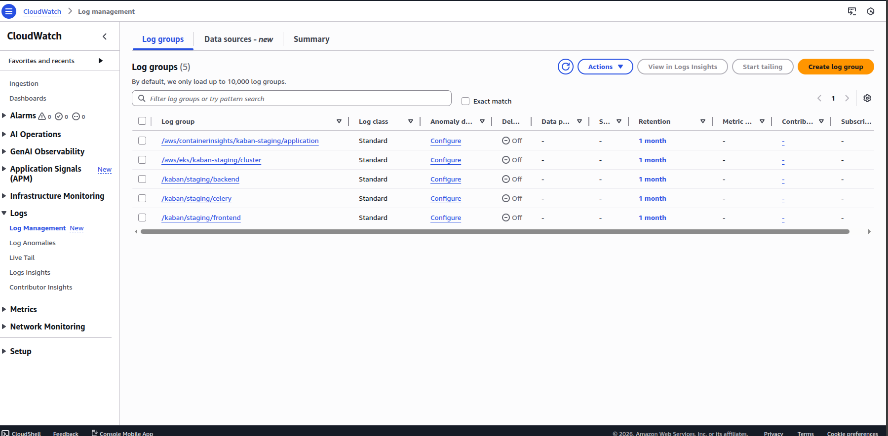
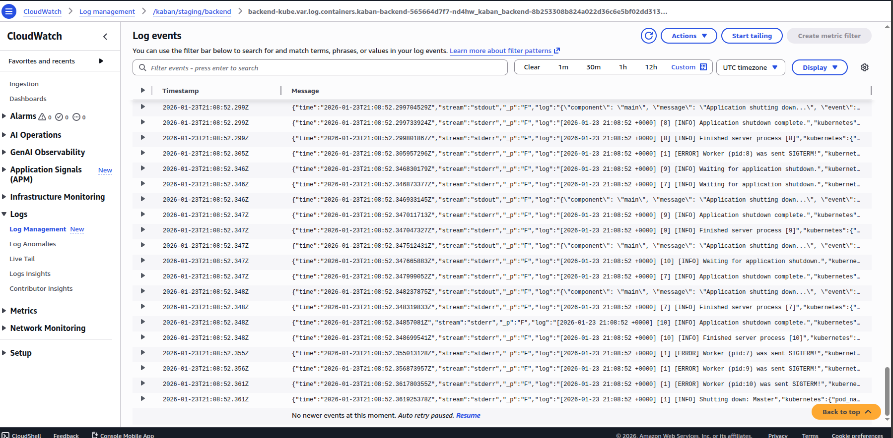
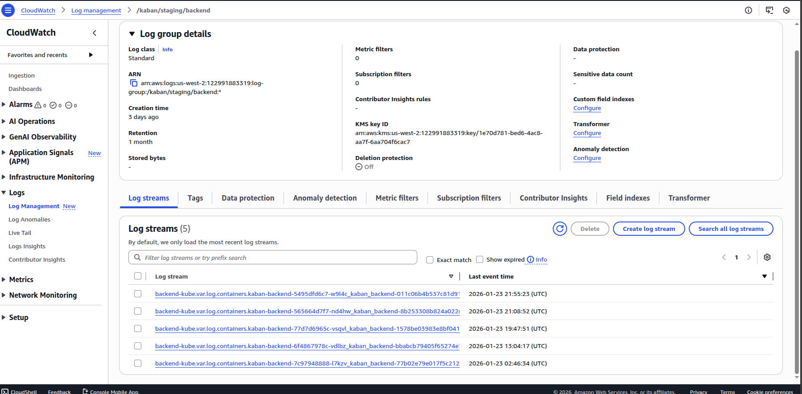

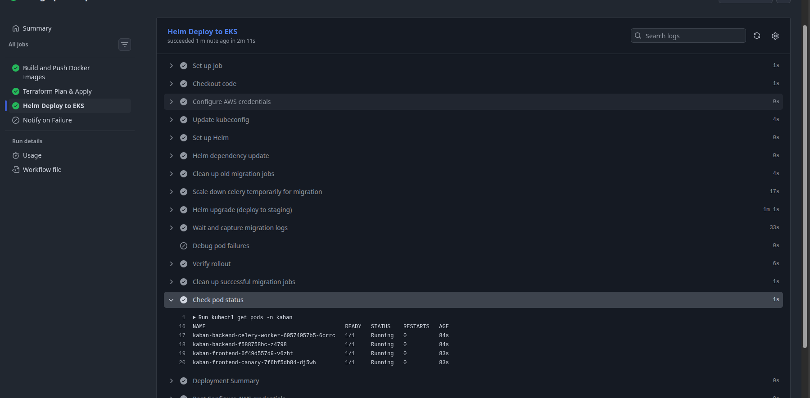

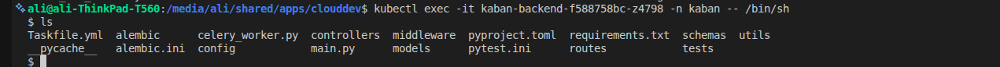
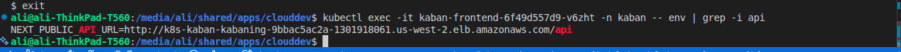

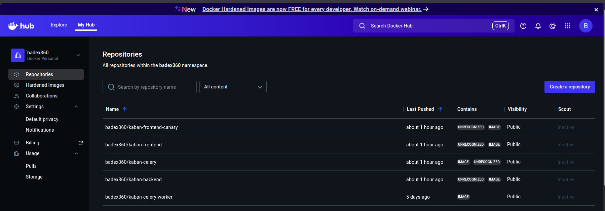

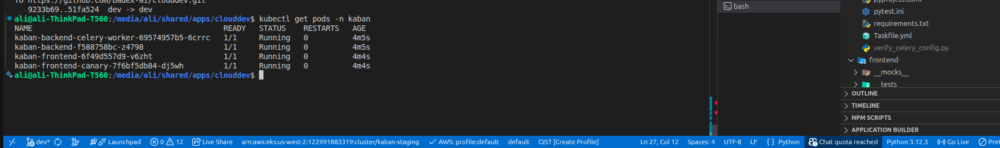
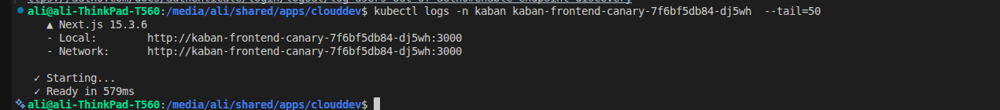
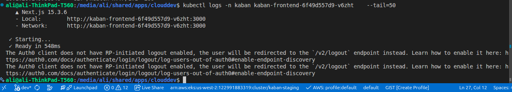
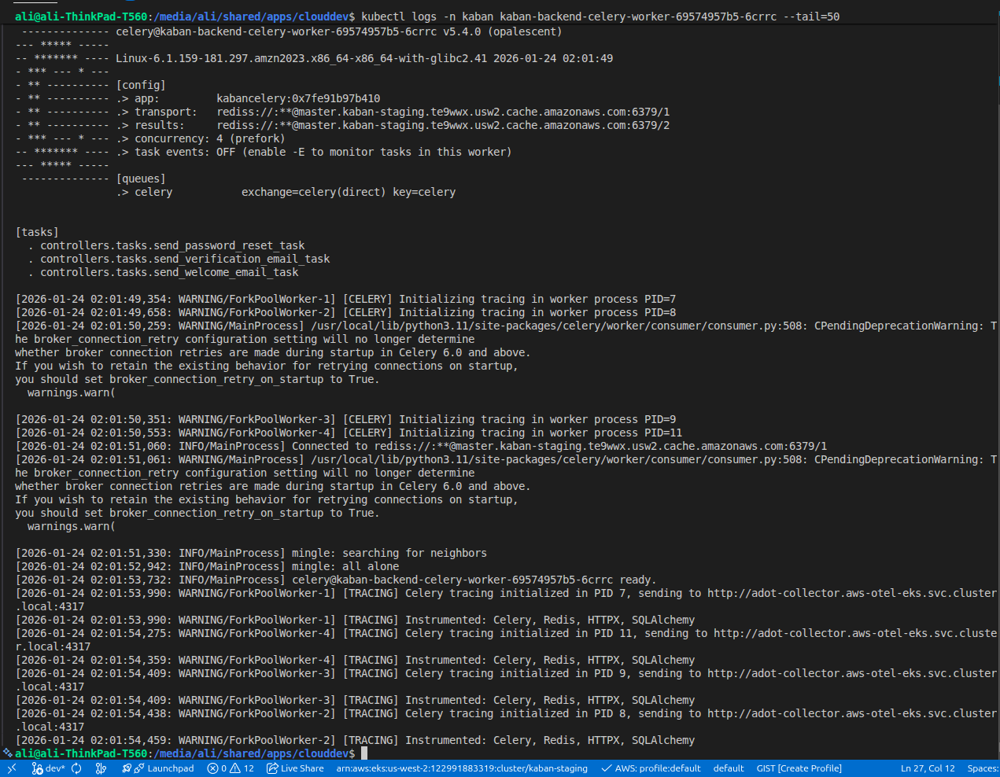
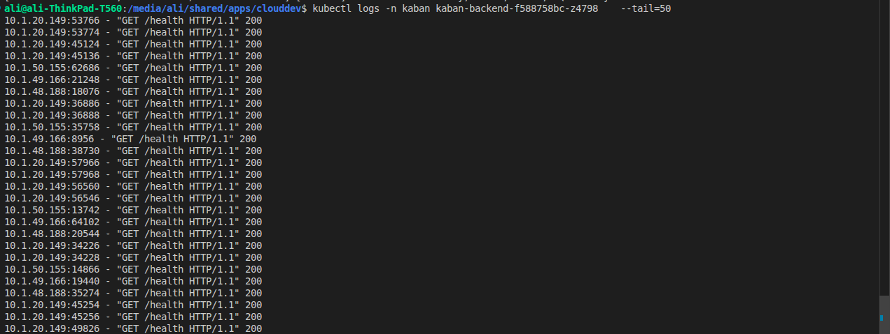

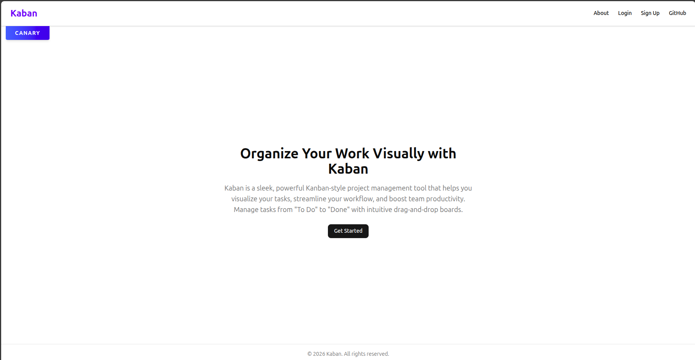
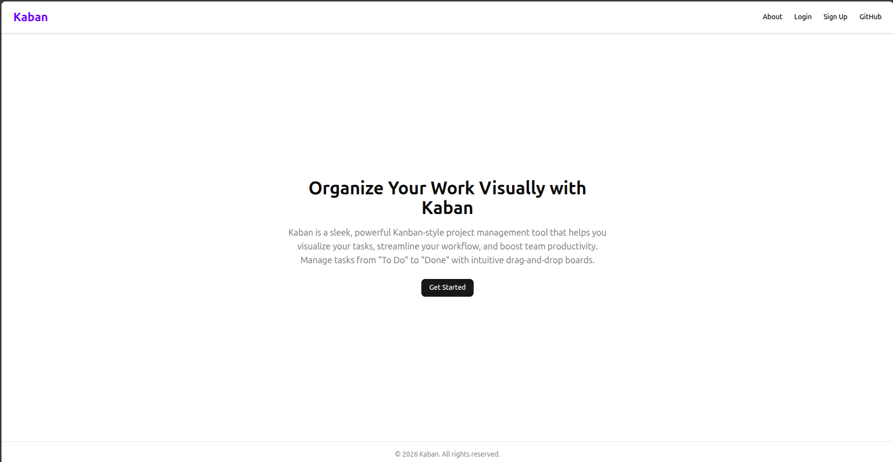

